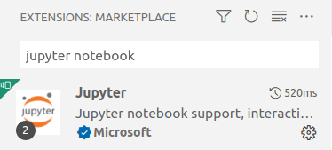
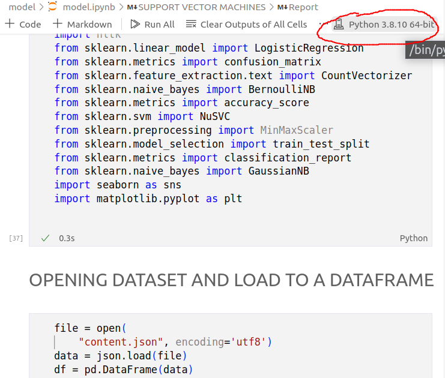
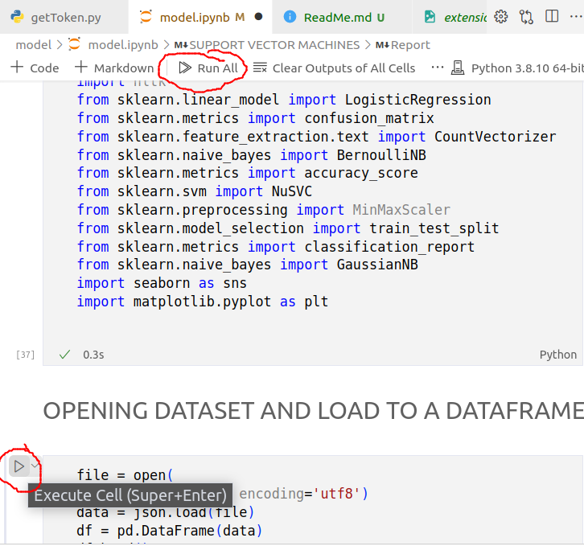

### How to run and test model:
### In the model folder, run the following command if you already have python and pip, otherwise: 
<br>

[Install Python and PIP For Ubuntu](https://www.digitalocean.com/community/tutorials/how-to-install-python-3-and-set-up-a-programming-environment-on-ubuntu-20-04-quickstart)
<br>

[Install Python and PIP For Windows](https://www.liquidweb.com/kb/install-pip-windows/)

```
pip install -r requirement.txt
```

### Install VSCode extensions for Jupyter Notebook


### Code for the model is in model.ipynb file, after installing the extension, open it and do the following steps:

Choosing Kernel version that matches the version used for pip commands


Run All/Run Each Block like normal Jupyter Notebook
